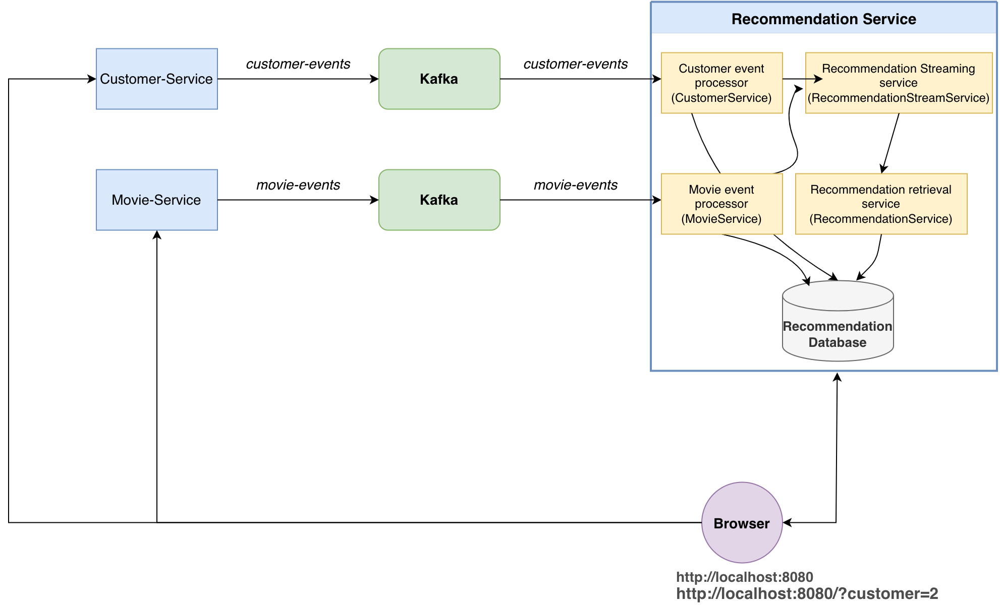

## 🎬 Movie Recommendation System

A real-time, event-driven movie recommendation system built with Spring Boot, Apache Kafka, Spring Cloud Stream, Spring Data JPA, and Project Reactor.

The system consists of three independent services that communicate asynchronously through Kafka events. Customers can change their favorite genre, movies can be added to the catalog, and the recommendation service reacts to these events and pushes updated recommendations to connected clients in real time.

This Event-Driven Architecture uses **Apache Kafka** with KRaft for cluster management. The Kafka cluster consists of **three(3) nodes** and is secured using **SASL authentication** and **SSL/TLS encryption.**

## 1.Features

- Customer management
- Movie management
- Personalized movie recommendations
- Newly added movie recommendations


## 2. Services

The application is composed of three services.

| Service | Port | Responsibility | Kafka |
|---|---:|---|---|
| Customer Service | `6060` | Customer management and favorite genres | Produces `customer-events` |
| Movie Service | `7070` | Movie catalog management | Produces `movie-events` |
| Recommendation Service | `8080` | Generates and streams recommendations | Consumes both topics |

**Architecture**



https://github.com/user-attachments/assets/fc512228-05d2-4ef0-916a-ab906cc220a3


---

### 2.1. Customer Service
The Customer Service manages customer information and is responsible for:
- Retrieving customer information
- Updating a customer's favorite genre
- Publishing customer events to Kafka

A customer record contains the following information:

```json
{
    "id": 1,
    "name": "Sam",
    "favorite_genre": "Action"
}
```
This service is boostrapped with 3 records. (see resource, data.sql)


### 2.2. Movie Service
The Movie Service manages the movie catalog and is responsible for:
- Adding movies
- Retrieving movies
- Managing movie information
- Publishing movie events to Kafka 

A movie record contains the following information:

```json
{
    "id": 1,
    "title": "Ariel",
    "voteAverage": 7.1,
    "voteCount": 262,
    "releaseDate": "1988-10-21",
    "revenue": 0,
    "runtime": 73,
    "backdropPath": "/dQL2wJZo05GDd21VgOacMeCuyZy.jpg",
    "budget": 0,
    "homepage": "",
    "overview": "/dQL2wJZo05GDd21VgOacMeCuyZy.jpg After the coal mine he works at closes and his father commits suicide, a Finnish man leaves for the city to make a living but there, he is framed and imprisoned for various crimes.",
    "popularity": 8.155,
    "posterPath": "/ojDg0PGvs6R9xYFodRct2kdI6wC.jpg",
    "genres": [
    "Drama",
    "Comedy",
    "Romance"
    ]
}
```

This service is boostrapped with ~100 000 records. (see resource, movies.jsonl and data.sql).
Note: One movie from `movies.jsonl` is consumed **every 3 second** for demo purpose. 
 
### 2.3. Recommendation Service

The Recommendation Service is the core of the application.
It consumes events from `customer-events` and `movie-events` topics and uses those events to update recommendation information.
It is responsible for:
- Generating newly-added movie recommendations
- Generating personalized recommendations for a given customer
- Push recommendation updates to connected clients
- Provide REST APIs
- Provide real-time Server-Sent Events streams

## 3. Running the Application
1- At the root of the project, run the command:
```
docker compose up -d
```
2- Run in the following order:
```
    customer-service
    movie-service
    recommendation-service
```
3- in the browser, access and test the app
```yaml
# by defaut customer with customerId=1
http://localhost:8080
# test customer with customerId=2
http://localhost:8080/?customer=2
```

4-After testing, run the command 

```yaml
docker compose down -v
```

## 4. Technology Stack
Java | Spring Boot | Spring Web | Spring Data | Spring Cloud | Apache Kafka
| Reactor | Server-Sent-Event | Maven | JavaScript


## 5.source
1. [Apache Kafka with Spring Boot 3 and Cloud Stream](https://dev.to/olymahmud/simplifying-kafka-with-spring-boot-3-and-cloud-stream-1p6)
2. [kafka configuration](https://github.com/luismr/kafka-cluster-docker-compose)
3. [Spring cloud stream with Apache kafka MQ](https://medium.com/@ganeshKarunanidhi/spring-cloud-stream-with-apache-kafka-mq-1a6cbd1ea617)
4. [Udemy course](https://www.udemy.com/course/kafka-java/?srsltid=AfmBOoqUQEv7l9-ik-suCGH1uG6feo8jZKLvM-EFfLlzKNGt03_JF9EG&couponCode=CP260817G1)
